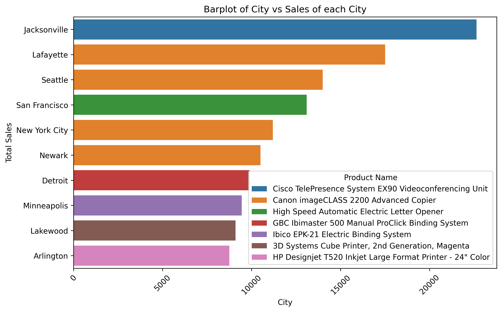
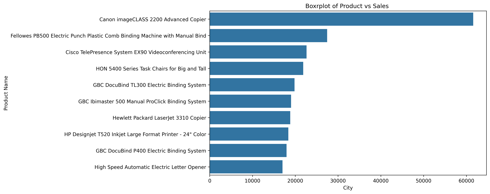
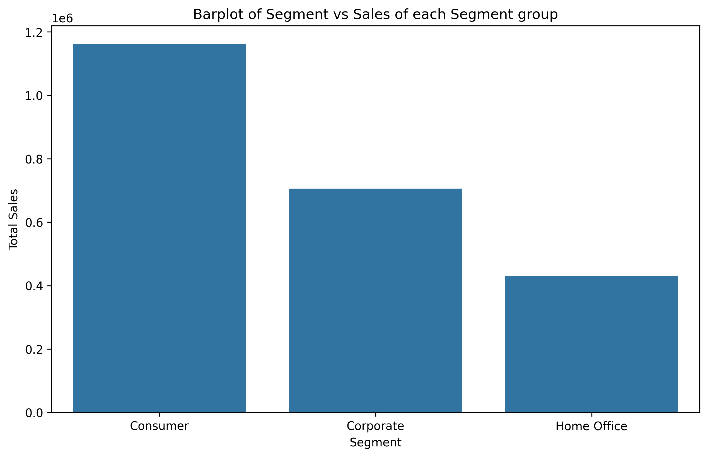
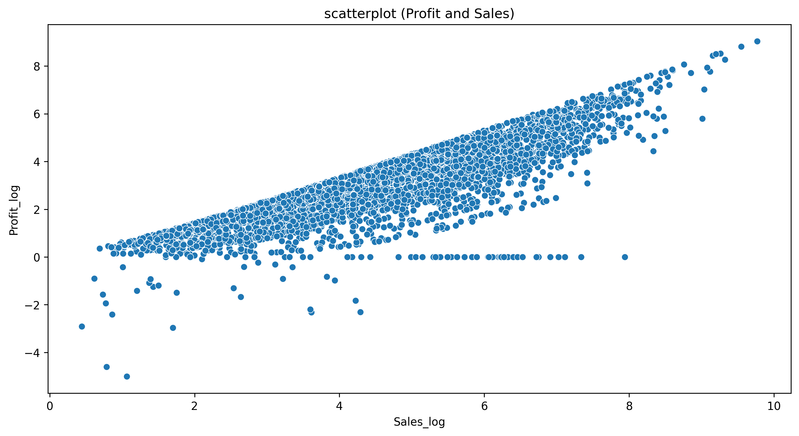

# Sales Performance and Discount Strategy

## Executive Summary

- Objective: This analysis aimed to optimize discount strategies and identify key drivers of profitability by examining global sales data.

- Key Finding: The product with maximum profit have discount of 20% and each product which are profitable have discount ranges from `0 to 20%` 

- Recommendation: The product quality matters not discount so my recommendation is that the company should focus more to improve the quality of the product and discount strategy should be from `0 to 20%` is enough and profitable even no disount have more profitable sales so my advice if product is not to expensive so keep it without discount

### 1. Introduction & Objectives

purpose: This report is a detail analysis of sales for strategical decision making for sales and marketing departments. The primary goal is to resolve the following business related questions

1. What is the optimal discount level that maximizes profit?
2. How does profitability vary across different countries and regions?
3. Which product categories are the top performers in terms of both sales volume and profit generation?

### 2. Data Sources and Methodology

Purpose:
This section outlines the origin of the data, the tools used for analysis, and the steps taken to prepare the data for exploration. This ensures the analysis is transparent, reproducible, and based on a reliable foundation.

Data Source: This analysis is based on a historical sales dataset from a global retail company, publicly available on Kaggle under the Apache 2.0 license. The dataset provides a comprehensive view of sales transactions, containing 9,994 records of orders placed between January 2015 and December 2018.

The data includes detailed information on:

Temporal Data: Order and ship dates, delivery duration.

Customer Information: Customer names, IDs, and geographic details (Country, City, State, Region).

Product Information: Product categories (Furniture, Office Supplies, Technology), sub-categories, and names.

Financial Metrics: Sales amount, quantity, discount percentage, discount value, profit, and cost of goods sold (COGS).

Tools & Technologies:

Python: The primary analysis was conducted using Python in a Jupyter Notebook environment. Key libraries included:

Pandas for data manipulation and cleaning.

NumPy for numerical operations.

Matplotlib and Seaborn for data visualization and creating static charts.

Data Cleaning: Initial data preparation involved handling missing values and ensuring data types were correct for analysis.

### 3. Analysis and Key Findings

#### 3.1 Top 10 Cities with the highest product sales

The above figure shows that the `'Jacksonville'` contains the product `'Cisco TelePresence System EX90 Videoconferenci...'` with the top notch sale of 22638.480

#### 3.2 Which Product has a highest over all sales 

The figure shows that `'the Canon imageCLASS 2200 Advanced Copier'` has the maximum sales then any of the other product

#### 3.3  which segment has the highest sales

From above figure we observe that Segment consumers have more more no of sales

#### 3.4 Impact of Sales on Profit

### 4. Recommendations and Next Steps

My recommendation is that for a small product do not keep discount and for large product keep discount ranges between `0 to 20%` and don't spend more money on COGS focus on `consumer` Segment. 